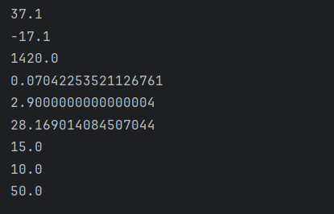

# Java Arithmetic Operators – Example Program

This repository contains a simple Java program that demonstrates the usage of **arithmetic operators** in Java and how arithmetic expressions are evaluated.  
It is intended for beginners who are learning Java fundamentals.

---

## 📌 Program Overview

The program demonstrates the use of arithmetic operators on `double` data types, including:

- Addition (`+`)
- Subtraction (`-`)
- Multiplication (`*`)
- Division (`/`)
- Modulus (`%`)
- Compound assignment operators (`+=`, `-=`, `*=`)

It also illustrates **operator precedence** and **left-to-right evaluation** when operators have the same priority.

---

## 🧪 Code Functionality

- Declares numeric variables using the `double` data type.
- Performs basic arithmetic operations and prints the results.
- Demonstrates how division and multiplication follow operator precedence.
- Uses compound assignment operators to modify variable values.
- Prints all results to the console using `System.out.println()`.

---

## 🖥️ Output

The program output is shown below:

---

## 📂 File Information

- `Arithmetic_Operators.java` — Java source code
- `output.png` — Screenshot of the program output
- `README.md` — Project documentation

---

## 👨‍💻 Author

**Tejas Halvankar**  
📧 Email: [tejashalvankar0@gmail.com]  
🌐 GitHub: [Tejas-H01](https://github.com/Tejas-H01)
