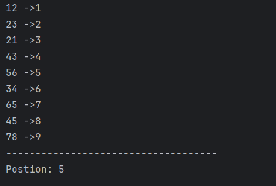
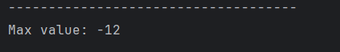
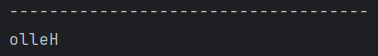
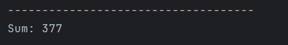
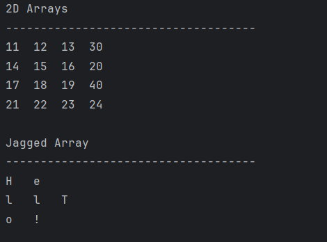

# Java Arrays – Example Programs

This folder contains multiple Java programs that demonstrate the usage of **arrays in Java**, including one-dimensional arrays, two-dimensional arrays, jagged arrays, and common array operations.  
These programs are intended for beginners who are learning array fundamentals and traversal techniques in Java.

---

## 📌 Program Overview

The programs in this folder cover the following array concepts:

- Searching for an element in an array
- Finding the maximum value in an array
- Reversing an array
- Calculating the sum of array elements
- Working with 2D arrays and jagged arrays

Each program focuses on a specific operation to build a clear understanding of how arrays work in Java.

---

## 🧪 Code Functionality

- **Find.java**
  - Searches for a specific element in an integer array.
  - Uses a loop with `break` to stop once the element is found.
  - Displays all elements with their positions.
  - Prints the position of the searched element.

- **Max.java**
  - Finds the maximum value in an integer array containing negative numbers.
  - Uses `Integer.MIN_VALUE` to safely handle all integer values.

- **Reverse.java**
  - Reverses a character array.
  - Prints the array elements in reverse order.

- **Sum.java**
  - Calculates the sum of all elements in an integer array.
  - Uses an enhanced `for-each` loop for traversal.

- **TwoD_Arrays.java**
  - Demonstrates traversal of a two-dimensional array.
  - Demonstrates jagged arrays with uneven row sizes.

---

## 🖥️ Output

### 🔹 Find Element in Array

---

### 🔹 Maximum Element in Array

---

### 🔹 Reverse Array

---

### 🔹 Sum of Array Elements

---

### 🔹 2D Array and Jagged Array

---

## 📂 File Information

- `Find.java` — Element search in array
- `Max.java` — Maximum element in array
- `Reverse.java` — Reverse array elements
- `Sum.java` — Sum of array elements
- `TwoD_Arrays.java` — 2D and jagged arrays
- `output.png`, `output1.png`, `output2.png`, `output3.png`, `output4.png` — Program outputs
- `README.md` — Folder documentation

---

## 👨‍💻 Author

**Tejas Halvankar**  
📧 Email: `tejashalvankar0@gmail.com`  
🌐 GitHub: [Tejas-H01](https://github.com/Tejas-H01)
