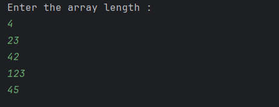

# Array Input Using Scanner

This program demonstrates how to take array size and elements as input from the user.  
It is intended for beginners learning arrays and user input handling in Java.

---

## 📌 Program Overview

The program allows the user to define the size of an integer array at runtime.  
It then accepts array elements from the keyboard using the `Scanner` class.

---

## 🧠 Concepts Used

- One-dimensional arrays
- Dynamic array size allocation
- `Scanner` class for user input
- `for` loop iteration
- Basic input handling

---

## 🧪 Code Functionality

- A `Scanner` object is created to read user input from the console.
- The user is prompted to enter the length of the array.
- An integer array is created dynamically using the given size.
- A `for` loop iterates through the array indices.
- Each array element is read from user input and stored in the array.
- The program completes after successfully storing all elements.

---

## 🖥️ Output

The program output is shown below:

---

## 📂 File Information

- pratice.java — Accepts array size and elements using Scanner
- output.png — Screenshot of the program output
- README.md — Project documentation

---

## 👨‍💻 Author

**Tejas Halvankar**  
📧 Email: `tejashalvankar0@gmail.com`  
🌐 GitHub: https://github.com/Tejas-H01
