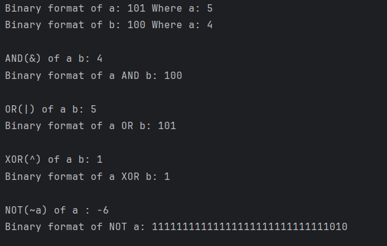

# Java Bitwise Operators – Example Program

This repository contains a simple Java program that demonstrates the usage of **bitwise operators** in Java and how they operate at the binary level.  
It is intended for beginners who are learning Java fundamentals and low-level operations.

---

## 📌 Program Overview

The program demonstrates the use of the following bitwise operators:

- Bitwise AND (`&`)
- Bitwise OR (`|`)
- Bitwise XOR (`^`)
- Bitwise NOT (`~`)

It also shows how integers are represented in **binary format** using Java’s built-in methods.

---

## 🧪 Code Functionality

- Declares integer variables and displays their binary representation.
- Performs bitwise AND, OR, XOR, and NOT operations.
- Prints both the **decimal result** and the **binary equivalent** of each operation.
- Uses `Integer.toBinaryString()` to visualize bit-level changes.
- Helps understand how bitwise operators manipulate individual bits.

---

## 🖥️ Output

The program output is shown below:

---

## 📂 File Information

- `Bitwise.java` — Java source code
- `output.png` — Screenshot of the program output
- `README.md` — Project documentation

---

## 👨‍💻 Author

**Tejas Halvankar**  
📧 Email: tejashalvankar0@gmail.com
🌐 GitHub: [Tejas-H01](https://github.com/Tejas-H01)

