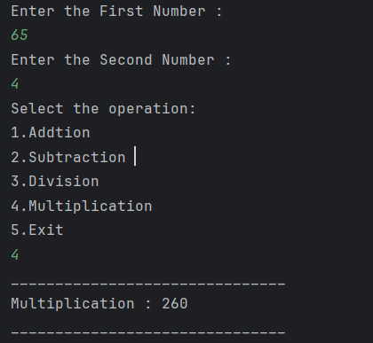

# Java Calculator – Example Program

This repository contains a simple Java program that demonstrates the implementation of a **basic calculator** using conditional logic and a `switch-case` statement.  
It is intended for beginners who are learning user input handling, arithmetic operations, and control flow in Java.

---

## 📌 Program Overview

The program allows the user to input two numbers and choose an arithmetic operation to perform on them.  
Based on the user’s choice, the calculator performs the selected operation and displays the result.

The calculator supports addition, subtraction, division, multiplication, and an option to exit.

---

## 🧪 Code Functionality

- Takes two integer inputs from the user using the `Scanner` class.
- Displays a menu of arithmetic operations.
- Uses a `switch-case` statement to handle user-selected operations.
- Performs:
  - Addition
  - Subtraction
  - Division
  - Multiplication
- Displays the result of the selected operation.
- Handles invalid choices using a default case.

---

## 🖥️ Output

The program output is shown below:

---

## 📂 File Information

- `Calculator.java` — Java source code
- `output.png` — Screenshot of the program output
- `README.md` — Project documentation

---

## 👨‍💻 Author

**Tejas Halvankar**  
📧 Email: `tejashalvankar0@gmail.com`  
🌐 GitHub: [Tejas-H01](https://github.com/Tejas-H01)

