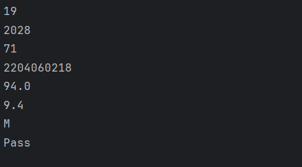

# Java Primitive Data Types – Example Program

This repository contains a simple Java program that demonstrates the usage of **primitive data types** in Java and how they are printed to the console.  
It is intended for beginners who are learning Java fundamentals.

---

## 📌 Program Overview

The program declares variables using all major Java primitive data types:

- `byte`
- `short`
- `int`
- `long`
- `float`
- `double`
- `char`
- `boolean`

Each variable is initialized with a sample value and printed to the console.  
A conditional `if-else` statement is used to demonstrate how a `boolean` value controls program flow.

---

## 🧪 Code Functionality

- Stores student-related data such as age, graduation year, roll number, enrollment number, percentage, CGPA, and gender.
- Prints each value using `System.out.println()`.
- Uses a boolean variable (`result`) to determine whether the student has **passed** or **failed**.

---

## 🖥️ Output

The program output is shown below:

---

## 📂 File Information

- `Datatype.java` — Java source code
- `output.png` — Screenshot of the program output
- `README.md` — Project documentation

---

## 👨‍💻 Author

**Tejas Halvankar**  
📧 Email: `tejashalvankar0@gmail.com`  
🌐 GitHub: [Tejas-H01](https://github.com/Tejas-H01)
