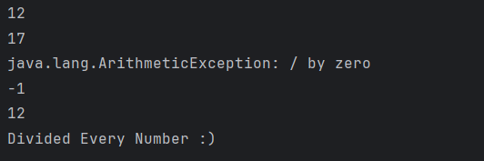

# Arithmetic Exception Handling Using try-catch

This program demonstrates how Java handles arithmetic exceptions using `try-catch`.  
It is intended for beginners to understand graceful error handling during runtime failures.

---

## 📌 Program Overview

The program performs division operations on elements of two integer arrays.  
It safely handles division by zero using exception handling so that the program continues execution.

---

## 🧠 Concepts Used

- Exception handling using `try-catch`
- `ArithmeticException`
- Arrays and indexed access
- Loop-based iteration
- Method-based error handling
- Returning fallback values on exception

---

## 🧪 Code Functionality

- Two integer arrays store numerators and denominators.
- A `for` loop iterates over both arrays simultaneously.
- The `divide()` method performs division inside a `try` block.
- When division by zero occurs, `ArithmeticException` is caught.
- The exception message is printed to the console.
- A default value `-1` is returned to maintain program flow.
- Program continues execution even after encountering an error.
- Final confirmation message executes successfully.

---

## 🖥️ Output

The program output is shown below:

---

## 📂 File Information

- ArithmeticEx.java — Demonstrates arithmetic exception handling using try-catch
- output.png — Screenshot of the program output
- README.md — Project documentation

---

## 👨‍💻 Author

**Tejas Halvankar**  
📧 Email: `tejashalvankar0@gmail.com`  
🌐 GitHub: https://github.com/Tejas-H01

