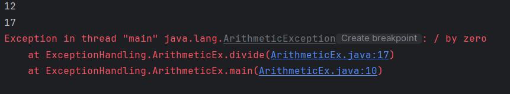

```markdown
# Arithmetic Exception Demonstration

This program demonstrates how arithmetic operations behave in Java when an exception occurs.  
It is designed for beginners learning exception handling fundamentals through real runtime behavior.

---

## 📌 Program Overview

The program performs division operations on two integer arrays element by element.  
It highlights what happens when a division by zero occurs during execution without handling the exception.

---

## 🧠 Concepts Used

- Arithmetic operations in Java
- Arrays and indexed access
- Loop-based iteration
- Method calling and return values
- Runtime exceptions (`ArithmeticException`)

---

## 🧪 Code Functionality

- Two integer arrays store numerators and denominators respectively.
- A `for` loop iterates through the arrays using a common index.
- The `divide()` method performs division and returns the result.
- When the denominator value is `0`, the JVM throws an `ArithmeticException`.
- Program execution stops immediately at the point of exception.
- The final print statement is not executed due to unhandled exception.

---

## 🖥️ Output

The program output is shown below:



---

## 📂 File Information

- ArithmeticEx.java — Demonstrates arithmetic exception during division
- output.png — Screenshot of the program output
- README.md — Project documentation

---

## 👨‍💻 Author

**Tejas Halvankar**  
📧 Email: `tejashalvankar0@gmail.com`  
🌐 GitHub: https://github.com/Tejas-H01
```

