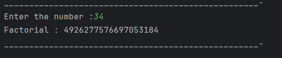

# Java Factorial Calculation – Example Program

This repository contains a simple Java program that calculates the **factorial of a number** using recursion.  
It is intended for beginners who are learning methods, recursion, and basic mathematical logic in Java.

---

## 📌 Program Overview

The program takes an integer input from the user and computes its **factorial**.  
Factorial of a number `n` is defined as:

`n! = n × (n − 1) × (n − 2) × ... × 1`

The calculation is implemented using a **recursive method**.

---

## 🧪 Code Functionality

- Takes user input using the `Scanner` class.
- Calls a recursive method `fact()` to compute the factorial.
- Uses a base condition to stop recursion.
- Multiplies the current value with the result of the recursive call.
- Prints the final factorial value to the console.

---

## 🖥️ Output

The program output is shown below:

---

## 📂 File Information

- `Factorial.java` — Java source code
- `output.png` — Screenshot of the program output
- `README.md` — Project documentation

---

## 👨‍💻 Author

**Tejas Halvankar**  
📧 Email: `tejashalvankar0@gmail.com`  
🌐 GitHub: [Tejas-H01](https://github.com/Tejas-H01)

