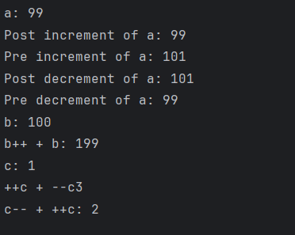

# Java Increment and Decrement Operators – Example Program

This repository contains a simple Java program that demonstrates the behavior of **increment (`++`) and decrement (`--`) operators** in Java.  
It is intended for beginners who are learning how pre and post operations work in Java expressions.

---

## 📌 Program Overview

The program demonstrates the use of:

- Post-increment (`a++`)
- Pre-increment (`++a`)
- Post-decrement (`a--`)
- Pre-decrement (`--a`)

It also includes mixed expressions to show how Java evaluates expressions involving increment and decrement operators.

---

## 🧪 Code Functionality

- Demonstrates the difference between **post** and **pre** increment.
- Demonstrates the difference between **post** and **pre** decrement.
- Shows how variable values change during expression evaluation.
- Uses mixed expressions such as `b++ + b` and `++c + --c` to explain order of execution.
- Prints intermediate and final values using `System.out.println()`.

---

## 🖥️ Output

The program output is shown below:

---

## 📂 File Information

- `Increment_Decrement.java` — Java source code
- `output.png` — Screenshot of the program output
- `README.md` — Project documentation

---

## 👨‍💻 Author

**Tejas Halvankar**  
📧 Email: [tejashalvankar0@gmail.com] 
🌐 GitHub: [Tejas-H01](https://github.com/Tejas-H01)

