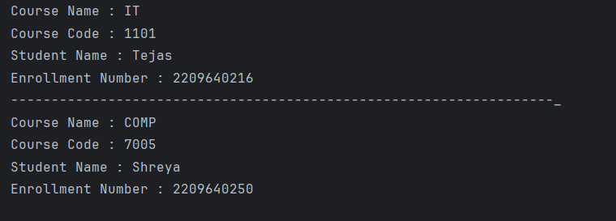

# Java Inner Class – Course Enrollment Example Program

This repository contains a Java program that demonstrates the use of a **member inner class** in Java using a course enrollment example.  
It is intended for beginners who are learning inner classes, object relationships, and how inner classes access outer class data.

---

## 📌 Program Overview

The program models a **Course and Enrollment system** where an enrollment logically belongs to a specific course.  
A **member inner class** is used to represent student enrollment within a course.

This design shows how inner classes naturally represent objects that cannot exist independently of their outer class.

---

## 🧪 Code Functionality

- Defines an outer class `Course` that:
  - Stores course name and course code
  - Initializes course details using a constructor
- Defines a **member inner class** `Enrollment` that:
  - Stores student name and enrollment number
  - Accesses private members of the outer `Course` class
- Creates inner class objects using an outer class instance.
- Displays complete course and student enrollment details.
- Demonstrates how multiple enrollments can exist for different courses.

---

## 🖥️ Output

The program output is shown below:

---

## 📂 File Information

- `Course.java` — Outer class with member inner class
- `Test2.java` — Main test class
- `output.png` — Screenshot of the program output
- `README.md` — Project documentation

---

## 👨‍💻 Author

**Tejas Halvankar**  
📧 Email: `tejashalvankar0@gmail.com`  
🌐 GitHub: [Tejas-H01](https://github.com/Tejas-H01)

