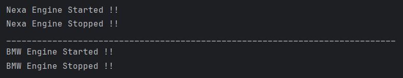

# IfNotInnerClass Demonstration

This program demonstrates how object interaction and behavior management work **without using inner classes**.  
It is intended for Java learners to understand reminder concepts before moving to inner classes.

---

## 📌 Program Overview

The program simulates engine start and stop behavior using **separate classes instead of inner classes**.  
It shows how an outer/helper class controls another class by holding its object reference explicitly.

---

## 🧠 Concepts Used

- Class composition (object inside another object)
- Encapsulation using private fields with getters and setters
- Object linking via constructor injection
- Conditional logic using boolean state
- Comparison groundwork for understanding Inner Classes

---

## 🧪 Code Functionality

- `IfNotInnerClass` represents a basic model class holding engine state and model name.
- Engine state is controlled using getter and setter methods, maintaining encapsulation.
- `IfNotInnerClass_OuterClass` acts as a controller class that **accepts the model object via constructor**.
- This creates an explicit object link between the controller and the model.
- Engine start/stop logic is implemented using condition checks on the linked object.
- `IfNotInnerClassTest` creates multiple objects to demonstrate independent behavior.
- This approach shows **more boilerplate and looser coupling** compared to inner classes.

---

## 🖥️ Output

The program output is shown below:

---

## 📂 File Information

- IfNotInnerClass.java — Model class holding engine state and data
- IfNotInnerClass_OuterClass.java — Controller class managing behavior via object reference
- IfNotInnerClassTest.java — Test class demonstrating object linking and execution
- output.png — Screenshot of the program output
- README.md — Project documentation

---

## 👨‍💻 Author

**Tejas Halvankar**  
📧 Email: `tejashalvankar0@gmail.com`  
🌐 GitHub: https://github.com/Tejas-H01

