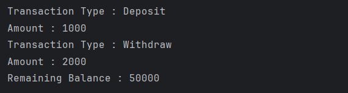

# Java Inner Class – Bank Account Transaction Example Program

This repository contains a Java program that demonstrates the use of a **member inner class** in Java using a bank account transaction example.  
It is intended for beginners who are learning inner classes, object relationships, and controlled access to class members.

---

## 📌 Program Overview

The program models a **Bank Account** system where each transaction logically belongs to a bank account.  
A **member inner class** is used to represent transactions, allowing direct access to the outer class’s private data.

This design closely reflects real-world relationships between objects.

---

## 🧪 Code Functionality

- Defines an outer class `BankAccount` that:
  - Stores account holder name and balance
  - Supports deposit and withdrawal operations
- Defines a **member inner class** `Transaction` that:
  - Represents individual transactions
  - Stores transaction type and amount
- Creates inner class objects from within the outer class.
- Allows the inner class to access outer class data.
- Demonstrates object initialization using constructors.
- Displays transaction details and remaining account balance.

---

## 🖥️ Output

The program output is shown below:

---

## 📂 File Information

- `BankAccount.java` — Outer class with member inner class
- `Test.java` — Main test class
- `output.png` — Screenshot of the program output
- `README.md` — Project documentation

---

## 👨‍💻 Author

**Tejas Halvankar**  
📧 Email: `tejashalvankar0@gmail.com`  
🌐 GitHub: [Tejas-H01](https://github.com/Tejas-H01)

