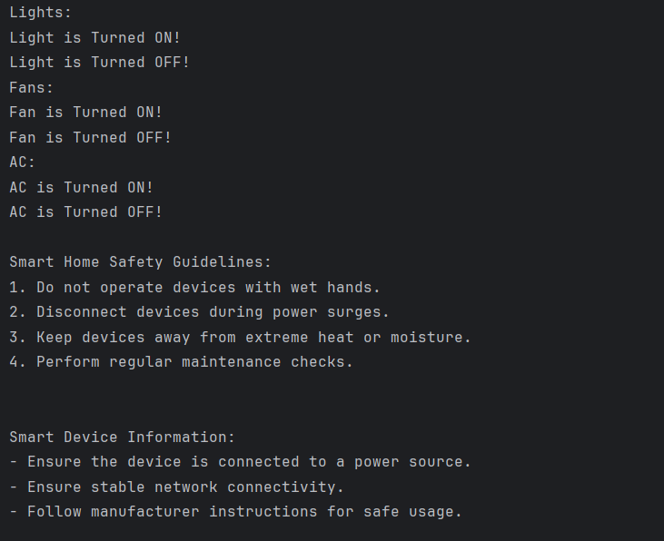

# Java Interfaces – Smart Device Example Program

This repository contains a Java program that demonstrates the use of **interfaces** in Java using a smart device system example.  
It is intended for beginners who are learning interfaces, default methods, static methods, and polymorphic behavior in Java.

---

## 📌 Program Overview

The program models a **smart home device system** where different devices follow a common interface.  
An interface defines the required behavior, while multiple device classes implement that behavior in their own way.

The program also demonstrates the use of **default methods** and **static methods** inside an interface.

---

## 🧪 Code Functionality

- Defines an interface `SmartDevice` that:
  - Declares abstract methods `turnOn()` and `turnOff()`
  - Includes a `default` method `deviceInfo()` for common behavior
  - Includes a `static` method `showSafetyGuidelines()` for shared utility behavior
- Implements the interface using:
  - `SmartLight`
  - `SmartFan`
  - `SmartAC`
- Demonstrates polymorphism by using an interface reference to control different devices.
- Calls interface static and default methods appropriately.
- Displays device actions and safety information on the console.

---

## 🖥️ Output

The program output is shown below:

---

## 📂 File Information

- `SmartDevice.java` — Interface definition
- `SmartLight.java` — Smart light implementation
- `SmartFan.java` — Smart fan implementation
- `SmartAC.java` — Smart AC implementation
- `Test.java` — Main test class
- `output.png` — Screenshot of the program output
- `README.md` — Project documentation

---

## 👨‍💻 Author

**Tejas Halvankar**  
📧 Email: `tejashalvankar0@gmail.com`  
🌐 GitHub: [Tejas-H01](https://github.com/Tejas-H01)

