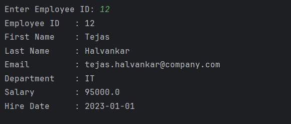

# Java JDBC – PreparedStatement Employee Lookup Example Program

This repository contains a Java program that demonstrates how to use **PreparedStatement** in JDBC to securely fetch employee data from a **PostgreSQL database**.  
It is intended for beginners who are learning JDBC, user input handling, and secure SQL query execution in Java.

---

## 📌 Program Overview

The program connects to a PostgreSQL database and retrieves employee details based on a **user-provided employee ID**.  
It uses `PreparedStatement` instead of `Statement` to prevent SQL injection and to handle dynamic query parameters safely.

---

## 🧪 Code Functionality

- Loads the PostgreSQL JDBC driver.
- Establishes a database connection using JDBC.
- Takes employee ID input from the user using the `Scanner` class.
- Uses a parameterized SQL query with `PreparedStatement`.
- Binds user input to the SQL query using placeholders (`?`).
- Executes the query and processes the `ResultSet`.
- Displays employee details if found.
- Handles the case where no employee record exists.
- Properly closes all database and input resources.

---

## 🖥️ Output

The program output is shown below:

---

## 📂 File Information

- `Employee.java` — Java source code
- `output.png` — Screenshot of the program output
- `README.md` — Project documentation

---

## 👨‍💻 Author

**Tejas Halvankar**  
📧 Email: `tejashalvankar0@gmail.com`  
🌐 GitHub: [Tejas-H01](https://github.com/Tejas-H01)

