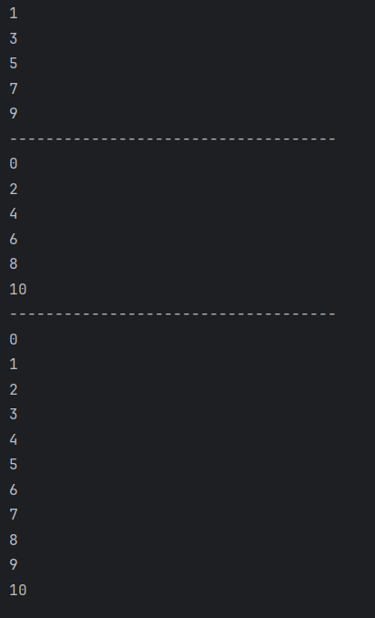

# Java Loops – Example Program

This repository contains a simple Java program that demonstrates the usage of **looping constructs** in Java.  
It is intended for beginners who are learning how iteration works in Java.

---

## 📌 Program Overview

The program demonstrates the use of the following loops:

- `for` loop
- `while` loop
- `do-while` loop

Each loop is used to perform a specific counting task to highlight its behavior.

---

## 🧪 Code Functionality

- Uses a `for` loop to print **odd numbers** from 1 to 10.
- Uses a `while` loop to print **even numbers** from 0 to 10.
- Uses a `do-while` loop to print numbers from 0 to 10.
- Separates outputs using visual separators for clarity.
- Demonstrates how loop conditions and increments work.

---

## 🖥️ Output

The program output is shown below:

---

## 📂 File Information

- `Loops.java` — Java source code
- `output.png` — Screenshot of the program output
- `README.md` — Project documentation

---

## 👨‍💻 Author

**Tejas Halvankar**  
📧 Email: `tejashalvankar0@gmail.com`  
🌐 GitHub: [Tejas-H01](https://github.com/Tejas-H01)

