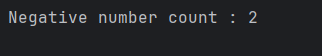

 # Negative Number Count in Array

This program demonstrates how to count negative numbers in an integer array using basic control flow.  
It is intended for beginners learning arrays, loops, and conditional statements in Java.

---

## 📌 Program Overview

The program iterates through an integer array and checks each element.  
It counts how many elements are negative and displays the total count as output.

---

## 🧠 Concepts Used

- One-dimensional arrays
- `for` loop iteration
- Conditional statements (`if`)
- Integer variables and counters
- Basic console output

---

## 🧪 Code Functionality

- An integer array is initialized with both positive and negative values.
- A counter variable is initialized to track negative numbers.
- A `for` loop traverses each element of the array.
- An `if` condition checks whether the current element is less than zero.
- The counter is incremented for every negative value found.
- The final count of negative numbers is printed to the console.

---

## 🖥️ Output

The program output is shown below:

---

## 📂 File Information

- negativecount.java — Counts the number of negative elements in an array
- output.png — Screenshot of the program output
- README.md — Project documentation

---

## 👨‍💻 Author

**Tejas Halvankar**  
📧 Email: `tejashalvankar0@gmail.com`  
🌐 GitHub: https://github.com/Tejas-H01
