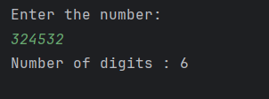

# Java Number of Digits – Example Program

This repository contains a simple Java program that calculates the **number of digits** in a given integer.  
It is intended for beginners who are learning loops, arithmetic operations, and basic number logic in Java.

---

## 📌 Program Overview

The program takes an integer input from the user and determines how many digits it contains.  
This is achieved by repeatedly dividing the number by 10 until it becomes zero.

---

## 🧪 Code Functionality

- Takes an integer input from the user using the `Scanner` class.
- Uses a `while` loop to process the number.
- Divides the number by 10 in each iteration.
- Counts how many times the loop runs to determine the number of digits.
- Displays the final digit count to the console.

---

## 🖥️ Output

The program output is shown below:

---

## 📂 File Information

- `NumberOfDigits.java` — Java source code
- `output.png` — Screenshot of the program output
- `README.md` — Project documentation

---

## 👨‍💻 Author

**Tejas Halvankar**  
📧 Email: `tejashalvankar0@gmail.com`  
🌐 GitHub: [Tejas-H01](https://github.com/Tejas-H01)

