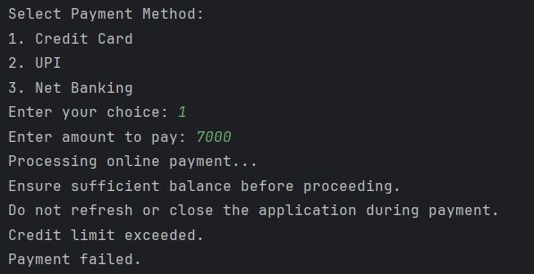
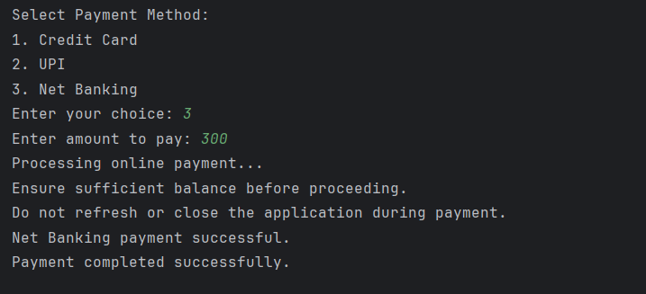

# Java Abstraction – Payment System Example Program

This repository contains a Java program that demonstrates the concept of **abstraction** in Object-Oriented Programming (OOP) using a real-world **payment system** example.  
It is intended for beginners who are learning abstract classes, method overriding, and runtime polymorphism in Java.

---

## 📌 Program Overview

The program simulates an **online payment system** where different payment methods are handled using abstraction.  
An abstract base class defines the common structure, while specific payment methods provide their own implementations.

The user can choose a payment method and enter an amount to process the payment.

---

## 🧪 Code Functionality

- Defines an abstract class `Payment` with:
  - An abstract method `makePayment()`
  - A concrete method `paymentInfo()`
- Implements different payment methods using subclasses:
  - Credit Card
  - UPI
  - Net Banking
- Uses runtime polymorphism to call the appropriate payment logic.
- Takes user input using the `Scanner` class.
- Displays payment status based on the selected payment method and available limits.
- Demonstrates abstraction by interacting with objects through the base class reference.

---

## 🖥️ Output

The program output is shown below:

### Output 1

### Output 2

---

## 📂 File Information

- `PaymentDemo.java` — Main program file
- `Payment.java` — Abstract base class
- `CreditCardPayment.java` — Credit card payment implementation
- `UPIPayment.java` — UPI payment implementation
- `NetBankingPayment.java` — Net banking payment implementation
- `output1.png` — Screenshot of first program output
- `output2.png` — Screenshot of second program output
- `README.md` — Project documentation

---

## 👨‍💻 Author

**Tejas Halvankar**  
📧 Email: `tejashalvankar0@gmail.com`  
🌐 GitHub: [Tejas-H01](https://github.com/Tejas-H01)

