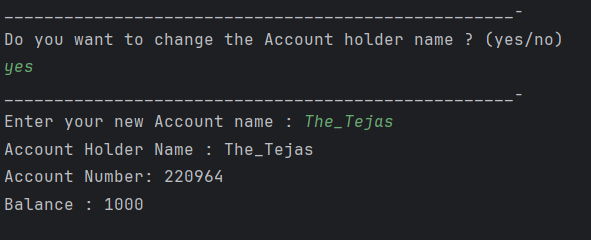

 # Java Encapsulation – Bank Account Example Program

This repository contains a Java program that demonstrates the concept of **encapsulation** in Object-Oriented Programming (OOP) using a bank account example.  
It is intended for beginners who are learning access modifiers, getters, setters, and controlled data access in Java.

---

## 📌 Program Overview

The program models a basic **Bank Account** system where sensitive data such as balance and account number are kept private.  
Access to these variables is controlled using **getter methods**, while selective modification is allowed using a **setter method**.

The program also interacts with the user to optionally update the account holder’s name.

---

## 🧪 Code Functionality

- Declares private variables for:
  - Account balance
  - Account number
  - Account holder name
- Provides getter methods to safely access private data.
- Restricts direct modification of balance and account number.
- Allows controlled modification of account holder name using a setter.
- Takes user input using the `Scanner` class.
- Uses conditional logic to update data based on user choice.
- Displays account details to the console.

---

## 🖥️ Output

The program output is shown below:

---

## 📂 File Information

- `BankAccount.java` — Java source code (package: `OOP_codes.Encapsulation`)
- `output.png` — Screenshot of the program output
- `README.md` — Project documentation

---

## 👨‍💻 Author

**Tejas Halvankar**  
📧 Email: `tejashalvankar0@gmail.com`  
🌐 GitHub: [Tejas-H01](https://github.com/Tejas-H01)

