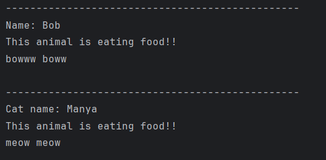

# Java Inheritance – Animal, Dog, and Cat Example Program

This repository contains a Java program that demonstrates the concept of **inheritance** and **method overriding** in Object-Oriented Programming (OOP) using an animal-based example.  
It is intended for beginners who are learning inheritance, method overriding, and basic class hierarchies in Java.

---

## 📌 Program Overview

The program models a simple **animal hierarchy** where a base class `animal` defines common properties and behaviors.  
Two child classes, `dog` and `cat`, inherit from the base class and override specific behaviors to provide their own implementations.

The program demonstrates how different objects respond differently to the same method calls.

---

## 🧪 Code Functionality

- Defines a base class `animal` with:
  - A private name field
  - Getter and setter methods
  - Common behaviors such as `eat()` and `sayHello()`
- Defines child classes `dog` and `cat` that:
  - Extend the `animal` class
  - Override the `sayHello()` method with animal-specific behavior
- Demonstrates inheritance and method overriding through object creation.
- Shows how the same method behaves differently based on the object type.

---

## 🖥️ Output

The program output is shown below:

---

## 📂 File Information

- `animal.java` — Base class
- `dog.java` — Child class extending `animal`
- `cat.java` — Child class extending `animal`
- `T.java` — Main test class
- `output.png` — Screenshot of the program output
- `README.md` — Project documentation

---

## 👨‍💻 Author

**Tejas Halvankar**  
📧 Email: `tejashalvankar0@gmail.com`  
🌐 GitHub: [Tejas-H01](https://github.com/Tejas-H01)

