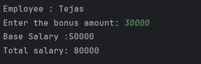

# Java Inheritance – Employee Salary Calculation Example Program

This repository contains a Java program that demonstrates the concept of **inheritance** and **method overriding** in Object-Oriented Programming (OOP) using an employee salary calculation example.  
It is intended for beginners who are learning class inheritance, method overriding, and the use of `super` in Java.

---

## 📌 Program Overview

The program models an **employee-management system** where a `Manager` class inherits from an `Employee` class.  
The base salary is defined in the parent class, while the child class extends the behavior by adding a bonus to calculate the total salary.

The program also shows how data can be accessed and modified through inherited methods.

---

## 🧪 Code Functionality

- Defines a base class `Employee` with:
  - Employee name
  - Basic salary
  - A method to calculate salary
- Defines a derived class `Manager` that:
  - Inherits from `Employee`
  - Overrides the `calculateSalary()` method
  - Uses `super.calculateSalary()` to include base salary
  - Accepts bonus input from the user
- Demonstrates runtime behavior using method overriding.
- Displays employee name and total calculated salary.

---

## 🖥️ Output

The program output is shown below:

---

## 📂 File Information

- `Employee.java` — Parent class
- `Manager.java` — Child class extending `Employee`
- `Test.java` — Main test class
- `output.png` — Screenshot of the program output
- `README.md` — Project documentation

---

## 👨‍💻 Author

**Tejas Halvankar**  
📧 Email: `tejashalvankar0@gmail.com`  
🌐 GitHub: [Tejas-H01](https://github.com/Tejas-H01)

