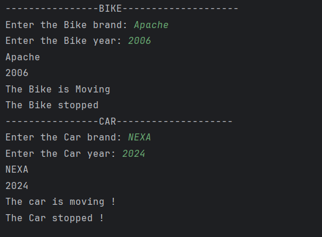

# Java Inheritance – Vehicle System Example Program

This repository contains a Java program that demonstrates the concept of **inheritance** in Object-Oriented Programming (OOP) using a vehicle-based example.  
It is intended for beginners who are learning inheritance, method overriding, and code reuse in Java.

---

## 📌 Program Overview

The program models a simple **vehicle system** where a base class `Vehicle` defines common properties and behaviors.  
Two child classes, `Bike` and `Car`, inherit from the `Vehicle` class and provide their own implementations of certain behaviors.

The program takes user input to set vehicle details and demonstrates how inherited methods work at runtime.

---

## 🧪 Code Functionality

- Defines a base class `Vehicle` with:
  - Private fields for brand and year
  - Getter and setter methods
  - Common behaviors such as `go()` and `stop()`
- Defines child classes `Bike` and `Car` that:
  - Extend the `Vehicle` class
  - Override the `go()` and `stop()` methods
- Uses method overriding to provide specific behavior for each vehicle type.
- Takes user input using the `Scanner` class.
- Demonstrates code reuse and runtime behavior through inheritance.

---

## 🖥️ Output

The program output is shown below:

---

## 📂 File Information

- `Vehicle.java` — Base class
- `Bike.java` — Child class extending `Vehicle`
- `Car.java` — Child class extending `Vehicle`
- `Test.java` — Main test class
- `output.png` — Screenshot of the program output
- `README.md` — Project documentation

---

## 👨‍💻 Author

**Tejas Halvankar**  
📧 Email: `tejashalvankar0@gmail.com`  
🌐 GitHub: [Tejas-H01](https://github.com/Tejas-H01)

