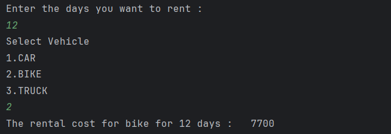

# Java Polymorphism – Vehicle Rental System Example Program

This repository contains a Java program that demonstrates the concept of **polymorphism** in Object-Oriented Programming (OOP) using a vehicle rental system example.  
It is intended for beginners who are learning runtime polymorphism, method overriding, and dynamic method dispatch in Java.

---

## 📌 Program Overview

The program simulates a **vehicle rental system** where different types of vehicles have different rental cost calculations.  
A base class defines a common method, while child classes override it to provide vehicle-specific rental logic.

The user selects a vehicle type and the number of days to rent, and the program calculates the total rental cost accordingly.

---

## 🧪 Code Functionality

- Defines a base class `Vehicle` with a method to calculate rental cost.
- Implements child classes:
  - `Car`
  - `Bike`
  - `Truck`
- Each child class overrides the `calculateRentalCost()` method.
- Uses a parent class reference to hold child class objects.
- Demonstrates runtime polymorphism through method overriding.
- Takes user input using the `Scanner` class.
- Calculates and displays rental cost based on vehicle type and rental duration.

---

## 🖥️ Output

The program output is shown below:

---

## 📂 File Information

- `Vehicle.java` — Base class
- `Car.java` — Child class extending `Vehicle`
- `Bike.java` — Child class extending `Vehicle`
- `Truck.java` — Child class extending `Vehicle`
- `Test.java` — Main test class
- `output.png` — Screenshot of the program output
- `README.md` — Project documentation

---

## 👨‍💻 Author

**Tejas Halvankar**  
📧 Email: `tejashalvankar0@gmail.com`  
🌐 GitHub: [Tejas-H01](https://github.com/Tejas-H01)

