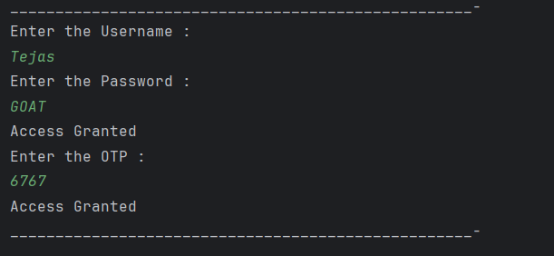

# Java Method Overloading – Login Validation Program

This repository contains a Java program that demonstrates the concept of **method overloading** through a simple login validation system.  
It is intended for beginners who are learning method overloading, conditional logic, and string comparison in Java.

---

## 📌 Program Overview

The program simulates a basic login system using a **username**, **password**, and **OTP**.  
It uses **method overloading** to validate user credentials in two stages:

- Username and password validation
- Username, password, and OTP validation

---

## 🧪 Code Functionality

- Defines fixed credentials using `final` variables.
- Takes user input using the `Scanner` class.
- Uses method overloading with two `check()` methods:
  - One method validates username and password.
  - Another method validates username, password, and OTP.
- Uses `String.equals()` for correct string comparison.
- Displays access status based on validation results.

---

## 🖥️ Output

The program output is shown below:

---

## 📂 File Information

- `LoginVal.java` — Java source code (package: `Overloading`)
- `output.png` — Screenshot of the program output
- `README.md` — Project documentation

---

## 👨‍💻 Author

**Tejas Halvankar**  
📧 Email: `tejashalvankar0@gmail.com`  
🌐 GitHub: [Tejas-H01](https://github.com/Tejas-H01)

