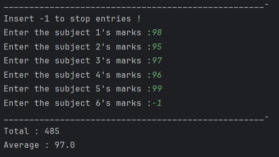

# Java Method Overloading – Result Evaluator Program

This repository contains a Java program that demonstrates the concept of **method overloading** in Java through a student result evaluation system.  
It is intended for beginners who are learning method overloading, arrays, and user input handling in Java.

---

## 📌 Program Overview

The program accepts marks for subjects from the user and evaluates the result based on the number of subjects entered.  
It uses **method overloading** to calculate the total and percentage for either **3 subjects** or **5 subjects**.

The user can stop entering marks by inputting `-1`.

---

## 🧪 Code Functionality

- Uses `Scanner` to take user input.
- Stores marks in an integer array.
- Allows early termination of input using `-1`.
- Determines how many subjects were entered.
- Calls an overloaded `result()` method based on the subject count.
- Calculates total marks and percentage for:
  - 3 subjects
  - 5 subjects
- Displays the calculated total and average percentage.

---

## 🖥️ Output

The program output is shown below:

---

## 📂 File Information

- `ResultEvaluator.java` — Java source code (package: `Overloading`)
- `output.png` — Screenshot of the program output
- `README.md` — Project documentation

---

## 👨‍💻 Author

**Tejas Halvankar**  
📧 Email: `tejashalvankar0@gmail.com`  
🌐 GitHub: [Tejas-H01](https://github.com/Tejas-H01)

