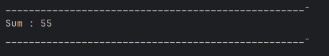

# Java Variable Arguments (Varargs) – Sum Program

This repository contains a simple Java program that demonstrates the use of **variable arguments (varargs)** to calculate the sum of multiple integers.  
It is intended for beginners who are learning flexible method parameters and iteration in Java.

---

## 📌 Program Overview

The program uses a method that accepts a **variable number of integer arguments** and calculates their total sum.  
This allows the method to be called with any number of values without defining multiple overloaded methods.

---

## 🧪 Code Functionality

- Uses a static method with variable arguments (`int... a`).
- Iterates over all provided values using an enhanced `for` loop.
- Calculates and returns the total sum of the integers.
- Calls the method from `main()` with multiple arguments.
- Prints the final result to the console.

---

## 🖥️ Output

The program output is shown below:

---

## 📂 File Information

- `Sum.java` — Java source code (package: `Overloading`)
- `output.png` — Screenshot of the program output
- `README.md` — Project documentation

---

## 👨‍💻 Author

**Tejas Halvankar**  
📧 Email: `tejashalvankar0@gmail.com`  
🌐 GitHub: [Tejas-H01](https://github.com/Tejas-H01)

