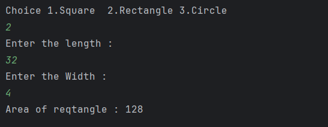

# Java Maximum Element in Array – Example Program

This repository contains a simple Java program that demonstrates how to **find the maximum value in an integer array**.  
It is intended for beginners who are learning arrays, loops, and comparison logic in Java.

---

## 📌 Program Overview

The program works with an integer array containing negative values and determines the **maximum element** present in the array.  
It uses a comparison-based approach by iterating through all elements.

---

## 🧪 Code Functionality

- Declares and initializes an integer array with negative values.
- Initializes a variable with `Integer.MIN_VALUE` to handle all possible integer cases.
- Iterates through the array using a `for` loop.
- Compares each element with the current maximum value.
- Updates and prints the maximum value found in the array.

---

## 🖥️ Output

The program output is shown below:

---

## 📂 File Information

- `Max.java` — Java source code (package: `Array`)
- `output.png` — Screenshot of the program output
- `README.md` — Project documentation

---

## 👨‍💻 Author

**Tejas Halvankar**  
📧 Email: `tejashalvankar0@gmail.com`  
🌐 GitHub: [Tejas-H01](https://github.com/Tejas-H01)

