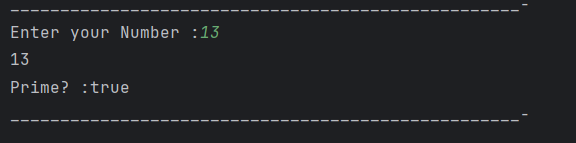

# Java Prime Number Check – Example Program

This repository contains a simple Java program that checks whether a given number is a **prime number** or not.  
It is intended for beginners who are learning functions, loops, and basic number logic in Java.

---

## 📌 Program Overview

The program takes an integer input from the user and determines whether the number is **prime**.  
A prime number is a number that has exactly two divisors: `1` and itself.

The logic is implemented using a separate method that returns a boolean result.

---

## 🧪 Code Functionality

- Takes user input using the `Scanner` class.
- Passes the input number to a `prime()` method.
- Uses a loop to count the number of divisors of the number.
- Checks divisibility up to `x / 2`.
- Returns `true` if the number is prime, otherwise returns `false`.
- Prints the result to the console.

---

## 🖥️ Output

The program output is shown below:

---

## 📂 File Information

- `PrimeNum.java` — Java source code
- `output.png` — Screenshot of the program output
- `README.md` — Project documentation

---

## 👨‍💻 Author

**Tejas Halvankar**  
📧 Email: `tejashalvankar0@gmail.com`  
🌐 GitHub: [Tejas-H01](https://github.com/Tejas-H01)

