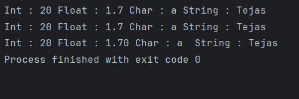

# Java Print Methods – Example Program

This repository contains a simple Java program that demonstrates different **printing methods** available in Java.  
It is intended for beginners who are learning how output is displayed on the console.

---

## 📌 Program Overview

The program demonstrates the usage of the following output methods:

- `System.out.print()`
- `System.out.println()`
- `System.out.printf()`

It shows how different data types can be printed and how formatted output works in Java.

---

## 🧪 Code Functionality

- Declares variables of different data types (`int`, `float`, `char`, `String`).
- Uses `System.out.print()` to print output without moving to a new line.
- Uses `System.out.println()` to print output and move to the next line.
- Uses `System.out.printf()` to print formatted output using format specifiers.
- Demonstrates formatting of floating-point values using precision control (e.g., `%.2f`).

---

## 🖥️ Output

The program output is shown below:

---

## 📂 File Information

- `Prints.java` — Java source code
- `output.png` — Screenshot of the program output
- `README.md` — Project documentation

---

## 👨‍💻 Author

**Tejas Halvankar**  
📧 Email: `tejashalvankar0@gmail.com`  
🌐 GitHub: [Tejas-H01](https://github.com/Tejas-H01)

