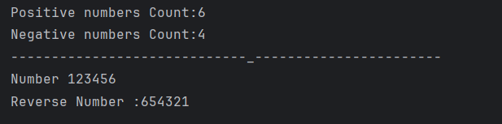

# Positive and Negative Number Count in Array

This program demonstrates how to count positive and negative numbers in an integer array.  
It is designed for beginners revising arrays, loops, and conditional logic in Java.

---

## 📌 Program Overview

The program iterates through an integer array containing both positive and negative values.  
It separately counts how many elements are positive (including zero) and how many are negative.

---

## 🧠 Concepts Used

- One-dimensional arrays
- `for` loop iteration
- Conditional statements (`if-else`)
- Integer counters
- Basic decision-making logic

---

## 🧪 Code Functionality

- An integer array is initialized with mixed positive and negative values.
- Two counter variables are used to track positive and negative numbers.
- A `for` loop traverses each element of the array.
- If the element is greater than or equal to zero, the positive counter is incremented.
- Otherwise, the negative counter is incremented.
- After traversal, both counts are printed to the console.

---

## 🖥️ Output

The program output is shown below:

---

## 📂 File Information

- Revision.java — Counts positive and negative numbers in an array
- output.png — Screenshot of the program output
- README.md — Project documentation

---

## 👨‍💻 Author

**Tejas Halvankar**  
📧 Email: `tejashalvankar0@gmail.com`  
🌐 GitHub: https://github.com/Tejas-H01

